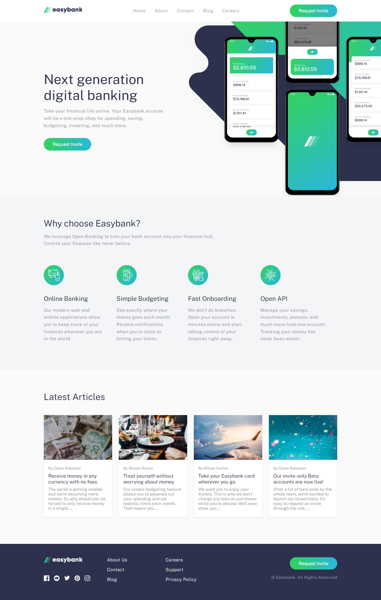
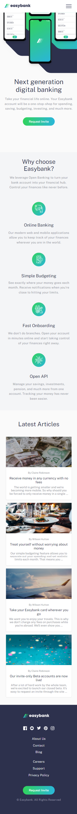
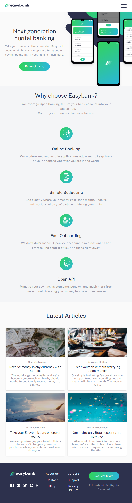
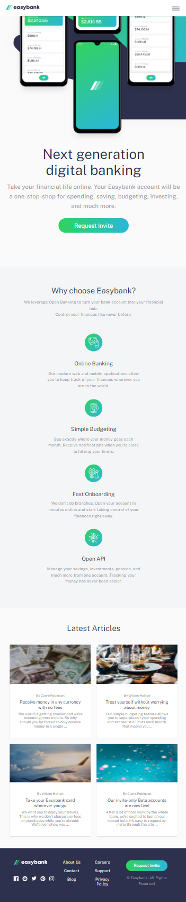
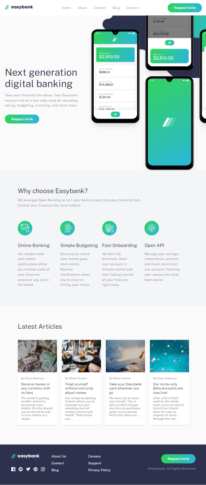

# Easybank landing page solution

This is a solution to the [Easybank landing page challenge on Frontend Mentor](https://www.frontendmentor.io/challenges/easybank-landing-page-WaUhkoDN).

## Table of contents

- [Easybank landing page solution](#easybank-landing-page-solution)
  - [Table of contents](#table-of-contents)
  - [Overview](#overview)
    - [The challenge](#the-challenge)
    - [Links](#links)
    - [Screenshot](#screenshot)
  - [My process](#my-process)
    - [Built with](#built-with)
    - [What I learned](#what-i-learned)
  - [Author](#author)

## Overview

### The challenge

Users should be able to:

- View the optimal layout for the site depending on their device's screen size
- See hover states for all interactive elements on the page
  
### Links

- Live Site URL: [easy bank landing page](https://easybank-landing-main.netlify.app/)
  
### Screenshot










## My process

### Built with

- Semantic HTML5 markup
- SCSS
- Flexbox
- Grid
- SVG

### What I learned

i've built a mini css framwork inspired by **bootstrap** (i'm planning to extend it much more in future)

To run this project simply install node modules and run sass, see below:

```shell
   npm install 
```

add to command in your package.json

```shell
"sass": "sass --watch scss/main.scss:dist/css/main.css"
```

then run a this command to watch sass

```shell
   npm run sass
```

## Author

- Github [@mounir-m4](https://github.com/mounir-m4)
- Twitter - [@mounirmotawakil](https://twitter.com/mounirmotawakil)
- Frontend Mentor - [@mounir-m4](https://www.frontendmentor.io/profile/mounir-m4)